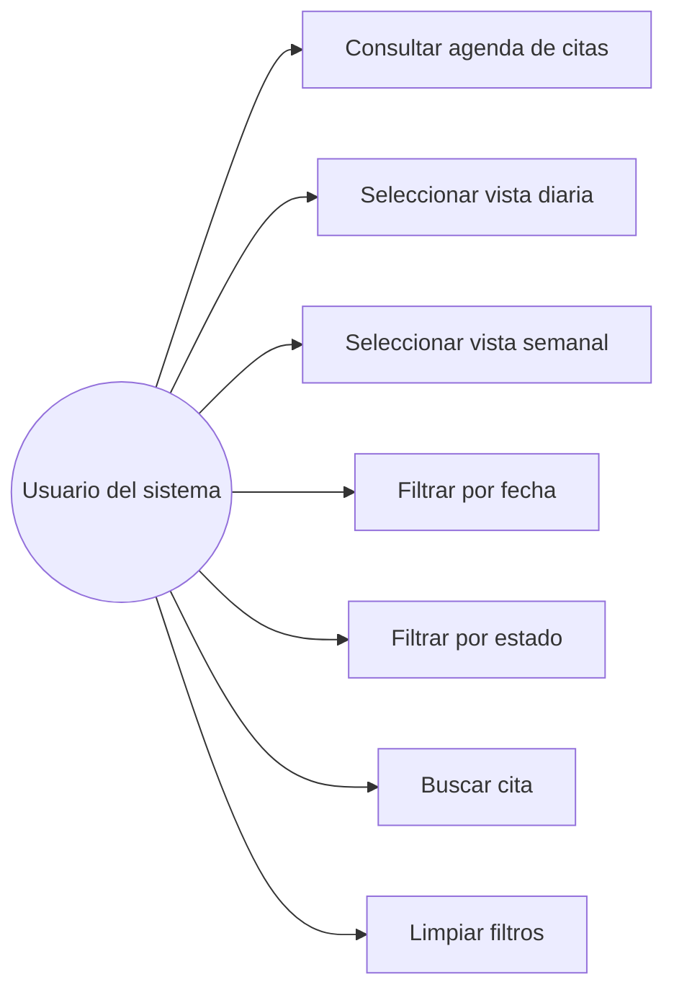
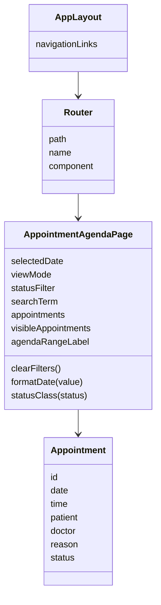
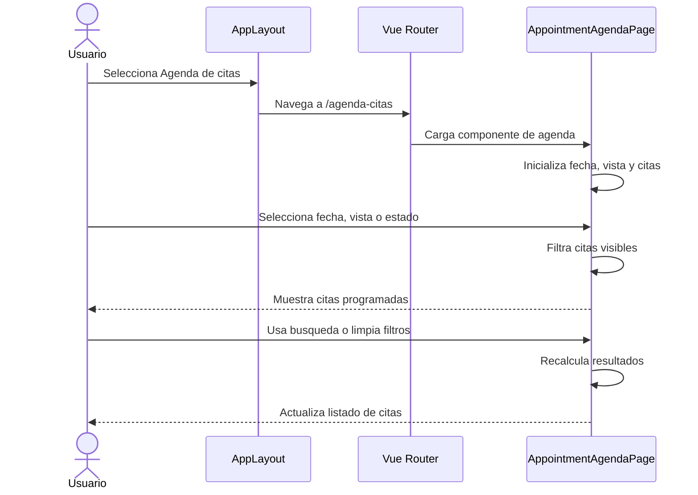

# Sprint 3 - Diagramas UML del módulo Agenda de citas

## Módulo asignado

Módulo 12: Agenda de citas.

El módulo permite consultar citas médicas programadas en una vista diaria o semanal. Incluye filtros por fecha, estado y búsqueda por paciente, médico o motivo de la cita.

## Diagrama de caso de uso

## Diagrama de clases

## Diagrama de secuencia

## Relación con los sprints

### Sprint 1

Se creó la estructura base del módulo, la ruta /agenda-citas, el enlace de navegación y una vista funcional inicial para consultar citas.

### Sprint 2

Se mejoró la vista con búsqueda, limpieza de filtros, ordenamiento por fecha y hora, y resumen del rango consultado.

### Sprint 3

Se documentó el diseño base mediante diagramas UML de caso de uso, clases y secuencia.